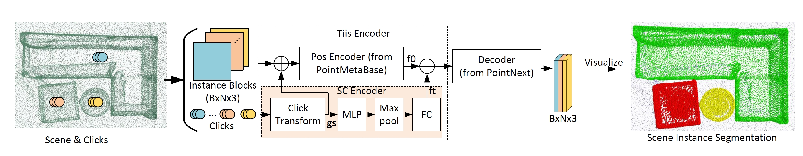

# TIME-ENCODED ITERATIVE INTERACTIVE SEGMENTATION FOR POINT CLOUD

This repository is the official implementation of [TiisNet]. 
Authors: Wentao Sun, Yiping Chen, Dedong Zhang, John S. Zelek, Jonathan Li

## Requirements
The completed code will come soon.
